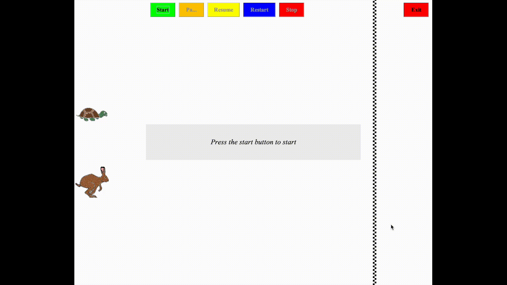

# Hare vs. Turtle Race Simulation

This project is a fun and educational simulation of the classic hare and turtle race, inspired by the famous fable. The program allows users to witness numerous simulations of the race, analyze the outcomes, and engage in friendly wagers based on probabilistic outcomes.

I worked on this in high school, while learning about Java (2016).



## Features
| Feature              | Description                                                                                                   |
|----------------------|---------------------------------------------------------------------------------------------------------------|
| Buffered Rendering   | Utilizes off-screen buffering to ensure smooth animation and prevent flickering.                   |
| Multithreading       | Implements separate threads for computation of movements and GUI updates, ensuring a responsive user experience.|
| Synchronization      | Employs semaphores for seamless coordination between computational and painting threads, avoiding conflicts.    |
| Race Simulation      | Allows users to experience variable outcomes of the hare and turtle race with a graphic representation.        |
| User Interaction     | Provides intuitive controls to start, pause, resume, restart, and exit the race.                               |
| Dynamic Visualization| Features animated movements of the hare and turtle, showcasing their progress towards the finish line.         |


## Getting Started
### Prerequisites
Ensure you have the following installed:
- Java Runtime Environment (JRE)
- Java Development Kit (JDK)

### Installation
Clone the repository or download the source code:
```bash
git clone git@github.com:antonioterpin/turtle-vs-hare.git
```
Compile the Java bytecode:
```bash
javac -sourcepath src -d out RunApp.java
```
Run the app:
```bash
java -classpath out RunApp
```

Execute RunApp to start the simulation.

### Usage
After starting the application, use the following buttons on the interface:

| Button | Functionality                                     |
|---------|-------------------------------------------------|
| Start   | Begin the race simulation.                      |
| Pause   | Pause the race at its current state.            |
| Resume  | Continue the race from where it was paused.     |
| Restart | Reset the simulation to start anew.             |
| Stop    | Completely halt the simulation.                 |
| Exit    | Close the application.                          |

## Limitations
1. The simulation uses random moves, so each race is unpredictable in a somewhat not-smooth way. 
2. Originally, this was built as an applet. Yup, it was that much time ago.
3. The graphical interface is simple and might not run smoothly on all systems.

## Contributing
This was a fun project to learn some stuff in Java, and while it is not actively seeking contributions, feedback and suggestions are always welcome.
